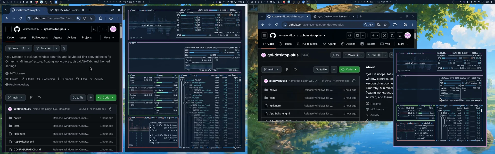

# QoL Desktop+

Minimize windows. Switch visually. Float any workspace.

Familiar window controls in your existing Omarchy bar, using your theme and hotkeys.

https://github.com/user-attachments/assets/14b43b29-6801-45b5-969e-3e4bec6f70c9

- **Visual Alt+Tab** — live window cards over your wallpaper.
- **Tiled or floating** — choose independently for each workspace.
- **Minimize and restore** — from the taskbar, keyboard, or an app’s own button.
- **Every workspace, one taskbar** — previews, grouping, and drag to reorder.



*Tiled when you want structure. Floating when you want room to move.*

## Install

```sh
omarchy plugin add https://github.com/xxsteven69xx/qol-desktop-plus --enable
```

The taskbar, hotkeys, and settings menu set themselves up. Shortcuts appear in **Super+K**.

| Action | Shortcut |
| --- | --- |
| Switch apps | Alt+Tab |
| Minimize | Super+M |
| Toggle workspace layout | Super+Ctrl+Alt+L |
| Activate taskbar slot | Super+Ctrl+Alt+1–0 |
| Settings | Super+Ctrl+Alt+S |

Settings also open from the taskbar’s right-click menu or **Super+Space → Setup → Taskbar**.

Requires Omarchy Quattro and Hyprland 0.56.2, with Python 3, g++, pkg-config, and matching Hyprland headers. The native companion builds locally on first use. Hyprland API changes may require a plugin update.

## Remove

```sh
omarchy plugin remove legion.taskbar
```

Removal restores minimized windows and removes the plugin’s shortcuts and menu entry. Personal settings remain saved.

[Controls and behavior](USAGE.md) · [Configuration](CONFIGURATION.md) · [Testing](TESTING.md) · [MIT license](LICENSE) · [Third-party notices](THIRD_PARTY_NOTICES.md)
